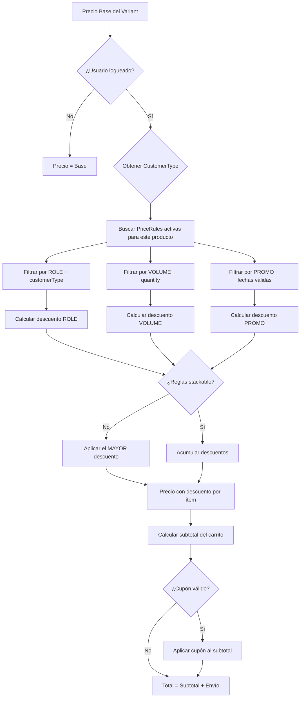

# Diagrama de Base de Datos — Ferretería E-Commerce

## Diagrama Entidad-Relación (Mermaid)

```mermaid
erDiagram
    %% ==========================================
    %% USUARIOS
    %% ==========================================
    users {
        string id PK
        string email UK
        string passwordHash
        string name
        string lastName
        string phone
        enum customerType "CONSUMER | TRADE | WHOLESALE"
        enum role "CUSTOMER | ADMIN | SUPER_ADMIN"
        boolean isApproved
        string taxIdType
        string taxId
        string companyName
        datetime createdAt
    }

    accounts {
        string id PK
        string userId FK
        string provider
        string providerAccountId
    }

    addresses {
        string id PK
        string userId FK
        string street
        string number
        string city
        string state
        string postalCode
        boolean isDefault
    }

    %% ==========================================
    %% CATÁLOGO
    %% ==========================================
    categories {
        string id PK
        string name
        string slug UK
        string parentId FK "self-reference"
        int position
        boolean isActive
    }

    brands {
        string id PK
        string name
        string slug UK
        string logoUrl
    }

    products {
        string id PK
        string name
        string slug UK
        text description
        string brandId FK
        boolean isActive
        boolean isFeatured
        string metaTitle
    }

    product_categories {
        string productId FK
        string categoryId FK
    }

    product_images {
        string id PK
        string productId FK
        string url
        int position
        boolean isPrimary
    }

    product_variants {
        string id PK
        string productId FK
        string sku UK
        decimal price "Precio base (lista)"
        decimal comparePrice "Precio anterior tachado"
        decimal costPrice "Costo (solo admin)"
        int stock
        int lowStockThreshold
        decimal weight "kg para envío"
        boolean isActive
    }

    attributes {
        string id PK
        string name UK "Color, Medida, Material"
    }

    attribute_values {
        string id PK
        string attributeId FK
        string value "Rojo, 1/2 pulgada"
    }

    variant_attribute_values {
        string variantId FK
        string attributeValueId FK
    }

    product_relations {
        string id PK
        string fromProductId FK
        string toProductId FK
        string type "CROSS_SELL | UP_SELL"
    }

    %% ==========================================
    %% PRECIO Y DESCUENTOS
    %% ==========================================
    price_rules {
        string id PK
        string name
        enum type "ROLE | VOLUME | PROMO"
        enum scope "ALL | PRODUCTS | CATEGORIES | BRANDS"
        enum customerType "nullable"
        int minQuantity "nullable, para VOLUME"
        enum discountType "PERCENTAGE | FIXED_AMOUNT"
        decimal discountValue
        int priority
        boolean isActive
        datetime startsAt
        datetime endsAt
        boolean isStackable
    }

    price_rule_products {
        string priceRuleId FK
        string productId FK
    }

    price_rule_categories {
        string priceRuleId FK
        string categoryId FK
    }

    price_rule_brands {
        string priceRuleId FK
        string brandId FK
    }

    coupons {
        string id PK
        string code UK
        enum discountType "PERCENTAGE | FIXED_AMOUNT"
        decimal discountValue
        decimal minPurchase
        int maxUses
        int usedCount
        datetime expiresAt
    }

    %% ==========================================
    %% CARRITO Y PEDIDOS
    %% ==========================================
    cart_items {
        string id PK
        string userId FK
        string variantId FK
        int quantity
    }

    orders {
        string id PK
        string orderNumber UK
        string userId FK
        enum status "PENDING...DELIVERED"
        enum customerType "snapshot"
        enum shippingMethod
        enum paymentMethod
        decimal subtotal
        decimal discountTotal
        decimal shippingCost
        decimal total
        string couponId FK
    }

    order_items {
        string id PK
        string orderId FK
        string variantId FK
        string productName "snapshot"
        string sku "snapshot"
        int quantity
        decimal unitPrice
        decimal originalPrice
        decimal discount
        decimal total
    }

    order_status_history {
        string id PK
        string orderId FK
        enum fromStatus
        enum toStatus
        string changedBy
        datetime createdAt
    }

    %% ==========================================
    %% ENVÍOS
    %% ==========================================
    shipping_zones {
        string id PK
        string name
        boolean isActive
    }

    shipping_zone_postal_codes {
        string id PK
        string shippingZoneId FK
        string postalCode
    }

    shipping_rates {
        string id PK
        string shippingZoneId FK
        decimal minWeight
        decimal maxWeight
        decimal price
        string estimatedDays
    }

    %% ==========================================
    %% RELACIONES
    %% ==========================================
    users ||--o{ accounts : "OAuth"
    users ||--o{ addresses : "tiene"
    users ||--o{ cart_items : "tiene"
    users ||--o{ orders : "realiza"
    users ||--o{ favorites : "guarda"

    categories ||--o{ categories : "padre-hijo"
    categories ||--o{ product_categories : "contiene"
    brands ||--o{ products : "fabrica"

    products ||--o{ product_categories : "pertenece"
    products ||--o{ product_images : "tiene"
    products ||--o{ product_variants : "tiene"
    products ||--o{ product_relations : "relacionado"

    product_variants ||--o{ variant_attribute_values : "tiene"
    product_variants ||--o{ cart_items : "en carrito"
    product_variants ||--o{ order_items : "vendido"

    attributes ||--o{ attribute_values : "tiene"
    attribute_values ||--o{ variant_attribute_values : "asignado"

    price_rules ||--o{ price_rule_products : "aplica a"
    price_rules ||--o{ price_rule_categories : "aplica a"
    price_rules ||--o{ price_rule_brands : "aplica a"

    orders ||--o{ order_items : "contiene"
    orders ||--o{ order_status_history : "historial"
    orders }o--o| coupons : "usa"
    orders }o--o| addresses : "envío a"

    shipping_zones ||--o{ shipping_zone_postal_codes : "cubre"
    shipping_zones ||--o{ shipping_rates : "tiene"

    favorites {
        string id PK
        string userId FK
        string productId FK
    }
```



## Ejemplos Concretos del Modelo de Precios

### Escenario 1: Grifería FV Puelo — Consumidor Final

```
Producto: Grifería FV Puelo
Variante: Cromo - SKU: FV-PUELO-CR
Precio base: $185.000
Compare price: $210.000 (se muestra tachado)

Usuario: Juan (CONSUMER)
Cantidad: 1

Reglas aplicables: ninguna
→ Precio final: $185.000
→ Se muestra: "$185.000" con "$210.000" tachado
```

### Escenario 2: Misma Grifería — Instalador (Gremio)

```
Producto: Grifería FV Puelo
Precio base: $185.000

Usuario: Carlos (TRADE, isApproved: true)
Cantidad: 1

PriceRule activa:
  - name: "Descuento Gremios"
  - type: ROLE
  - customerType: TRADE
  - discountType: PERCENTAGE
  - discountValue: 15
  - scope: ALL_PRODUCTS
  - priority: 10

→ Descuento: 15% = $27.750
→ Precio final: $157.250
```

### Escenario 3: Caño PVC — Descuento por Volumen

```
Producto: Caño PVC 110mm x 4m
Variante: SKU: PVC-110-4M
Precio base: $12.500

Usuario: María (CONSUMER)
Cantidad: 15 unidades

PriceRules activas para este producto:
  1. name: "Volumen +10 unidades PVC"
     type: VOLUME
     minQuantity: 10
     discountType: PERCENTAGE
     discountValue: 15
     scope: SPECIFIC_CATEGORIES (categoría: "Caños PVC")

→ qty >= 10 → aplica regla de volumen
→ Descuento: 15% = $1.875 por unidad
→ Precio unitario final: $10.625
→ Total (15 unidades): $159.375
```

### Escenario 4: Mayorista con Volumen + Cupón

```
Producto: Inodoro Ferrum Bari
Precio base: $245.000

Usuario: Constructora SRL (WHOLESALE, isApproved: true)
Cantidad: 20 unidades

PriceRules activas:
  1. name: "Precio Mayorista"
     type: ROLE, customerType: WHOLESALE
     discountType: PERCENTAGE, discountValue: 25%
     priority: 10

  2. name: "Volumen +10 Sanitarios"
     type: VOLUME, minQuantity: 10
     discountType: PERCENTAGE, discountValue: 10%
     priority: 5

Resolución (NO stackable):
  - Descuento ROLE: 25% = $61.250
  - Descuento VOLUME: 10% = $24.500
  - Se aplica el MAYOR: 25% (ROLE gana)
  
→ Precio unitario: $183.750
→ Subtotal (20 unidades): $3.675.000

Cupón aplicado: "OBRA2026"
  - discountType: PERCENTAGE
  - discountValue: 5
  - minPurchase: $500.000 ✓
  - Cupón descuento: 5% de $3.675.000 = $183.750

→ Total final: $3.491.250
```

### Escenario 5: Promoción Hot Sale (temporal)

```
Producto: Vanitory Schneider 80cm
Precio base: $320.000

PriceRule activa:
  - name: "Hot Sale -30%"
  - type: PROMO
  - discountType: PERCENTAGE
  - discountValue: 30
  - startsAt: 2026-05-12 00:00
  - endsAt: 2026-05-14 23:59
  - scope: SPECIFIC_PRODUCTS
  - priority: 100 (máxima)

Usuario: Pedro (TRADE → normalmente tiene 15% descuento)

Resolución:
  - Descuento ROLE: 15% = $48.000
  - Descuento PROMO: 30% = $96.000
  - Se aplica el MAYOR: 30% (PROMO gana por valor, y tiene mayor priority)

→ Precio final: $224.000
→ Se muestra con tag "HOT SALE" y el precio tachado de $320.000
```

## Flujo de Resolución de Precios


